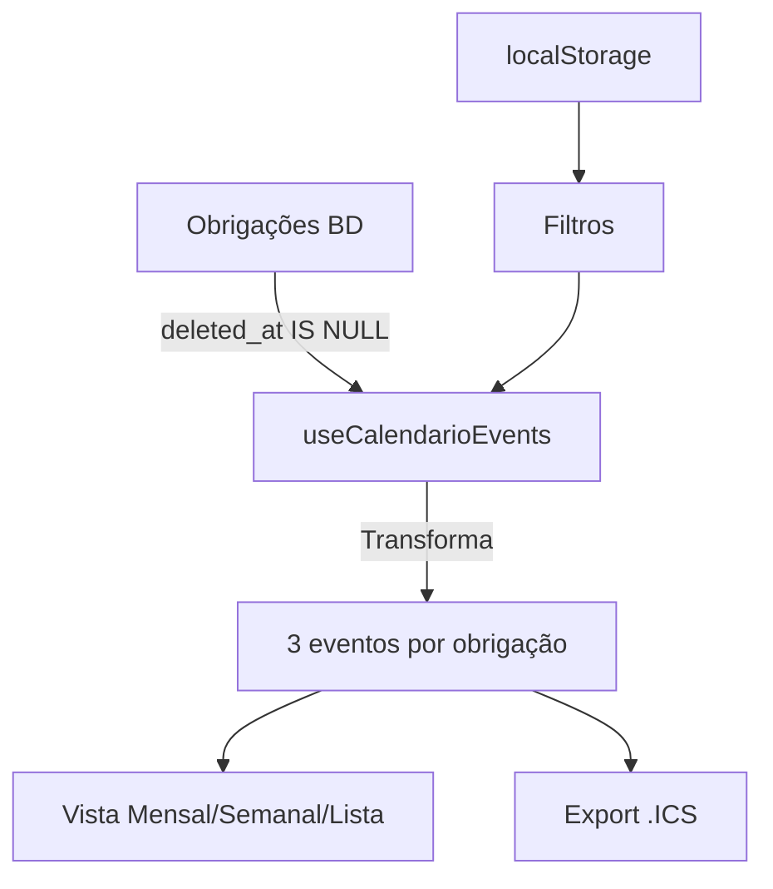

# Calendário de Obrigações

## Visão Geral

O módulo de Calendário permite visualizar todas as deadlines de obrigações fiscais em diferentes vistas (mensal, semanal, lista) e exportar para .ICS (compatível com Outlook, Google Calendar, Apple Calendar).

## Características

### 1. Eventos por Obrigação

Cada obrigação ativa (`deleted_at IS NULL`) gera até **3 eventos**:

- **Revisão Senior** (azul/info): `deadline_revisao_senior`
- **Deadline Interna** (amarelo/warning): `deadline_interna`
- **Deadline Oficial** (vermelho/destructive): `deadline_oficial`

Eventos sem data são automaticamente excluídos.

### 2. Vistas Disponíveis

#### Vista Mensal
- Grid de calendário com marcadores de eventos
- Lista completa dos eventos do mês abaixo do calendário
- Navegação entre meses

#### Vista Semanal
- 7 colunas (Segunda a Domingo)
- Eventos listados por dia
- Destaque para o dia atual

#### Vista Lista
- Lista cronológica de todos os eventos
- Suporta scroll/paginação
- Ideal para visualização de muitos eventos

### 3. Filtros Persistentes

Todos os filtros são guardados em `localStorage`:

- **Projetos**: Filtrar por projeto específico
- **Tipos**: IVA, IES, SAF-T, Modelo 10, Modelo 22, DMR, IFS, Outro
- **Estados**: Pendente, Em Revisão, Aprovado, Submetido, Concluído, Atrasado
- **Intervalo**: Hoje, Esta semana, Este mês, Próximos 30 dias, Todos
- **Apenas Oficiais**: Toggle para mostrar só deadlines oficiais

### 4. Export .ICS (iCalendar)

#### Formato
- Segue **RFC 5545** (iCalendar)
- Eventos **all-day** para compatibilidade máxima
- Timezone: `Europe/Lisbon`
- Charset: `UTF-8`

#### Estrutura de Evento

```
BEGIN:VEVENT
UID:obrigacao_id-REV@acr-deadlines
DTSTAMP:20250115T120000Z
DTSTART;VALUE=DATE:20250215
SUMMARY:IVA Jan/2025 – Projeto X – Revisão
DESCRIPTION:Projeto: Projeto X\nTipo: IVA\nPeríodo: Jan/2025\nEstado: Pendente\nCategoria: Revisão Senior
CATEGORIES:REVISAO
URL:https://app.example.com/obrigacoes/abc123
STATUS:CONFIRMED
TRANSP:TRANSPARENT
END:VEVENT
```

#### Compatibilidade Testada
- ✅ Microsoft Outlook (Desktop & Web)
- ✅ Google Calendar
- ✅ Apple Calendar (macOS, iOS)
- ✅ Thunderbird
- ✅ Outros clientes compatíveis com RFC 5545

#### Como Exportar
1. Clicar no botão "Exportar .ICS" (topo da página ou Definições)
2. Ficheiro é descarregado: `acr-deadlines-YYYY-MM-DD.ics`
3. Importar no cliente de calendário preferido

**Nota**: Apenas eventos **futuros** (>= hoje) são exportados.

### 5. Deep Links

Cada evento tem link direto para a obrigação:
- Formato: `/obrigacoes/{id}` (pode ser expandido para página de detalhe)
- Incluído no ficheiro .ICS via campo `URL`

Se a obrigação estiver apagada (`deleted_at IS NOT NULL`), deve mostrar mensagem amigável ou opção de restaurar.

## Tecnologias

- **react-day-picker**: Componente de calendário base
- **date-fns**: Manipulação de datas (timezone-aware com date-fns-tz)
- **date-fns-tz**: Suporte a timezone `Europe/Lisbon`
- **Custom hooks**: `useCalendarioEvents`, `useCalendarioFilters`
- **ICS Generator**: `src/lib/icsGenerator.ts`

## Performance

### Otimizações Implementadas
- ✅ Queries filtram apenas obrigações ativas (`deleted_at IS NULL`)
- ✅ Índices parciais: `idx_obrigacoes_ativas`, `idx_tarefas_ativas`
- ✅ Lazy loading de eventos por intervalo de datas
- ✅ Memoização de eventos agrupados por data
- ✅ Filtros persistentes evitam re-fetches desnecessários

### Recomendações Futuras
- Implementar paginação na vista Lista (>100 eventos)
- Cache de queries com `@tanstack/react-query`
- Virtualização para listas muito longas (react-window)

## Timezone & Formatação

### Timezone
- **Base de dados**: UTC (padrão Supabase)
- **Frontend**: Europe/Lisbon (via `date-fns-tz`)
- **Conversão**: Feita automaticamente em `src/lib/dateUtils.ts`

### Formatos de Data
- **Exibição**: `dd/MM/yyyy` (ex: 15/02/2025)
- **ICS all-day**: `YYYYMMDD` (ex: 20250215)
- **ICS timestamp**: `YYYYMMDDTHHmmssZ` (ex: 20250115T120000Z)

## Estrutura de Ficheiros

```
src/
├── pages/Calendario.tsx           # Página principal
├── components/CalendarioFilters.tsx # Componente de filtros
├── hooks/
│   ├── useCalendarioEvents.tsx    # Hook para buscar e transformar eventos
│   └── useCalendarioFilters.tsx   # Hook para filtros persistentes
├── lib/
│   ├── icsGenerator.ts            # Geração de ficheiros .ICS
│   └── dateUtils.ts               # Utilitários de data/timezone
└── README_CALENDARIO.md           # Esta documentação
```

## Fluxo de Dados



## QA Checklist

### Funcionalidades Core
- [ ] Vista Mensal mostra todos os eventos do mês
- [ ] Vista Semanal mostra 7 dias com eventos
- [ ] Vista Lista mostra eventos cronologicamente
- [ ] Filtros persistem ao recarregar a página
- [ ] Botão "Hoje" volta para o período atual
- [ ] Navegação entre meses/semanas funciona

### Filtros
- [ ] Filtro por Projeto funciona
- [ ] Filtro por Tipo funciona
- [ ] Filtro por Estado funciona
- [ ] Filtro de Intervalo (Hoje, Semana, Mês, 30 dias) funciona
- [ ] Toggle "Apenas Oficiais" mostra só eventos OFICIAL
- [ ] Limpar filtros restaura estado inicial

### Export .ICS
- [ ] Botão "Exportar .ICS" descarrega ficheiro
- [ ] Ficheiro tem nome correto: `acr-deadlines-YYYY-MM-DD.ics`
- [ ] Importar no Outlook funciona
- [ ] Importar no Google Calendar funciona
- [ ] Importar no Apple Calendar funciona
- [ ] Eventos são all-day (sem hora)
- [ ] Títulos e descrições estão corretos
- [ ] URLs apontam para obrigação correta
- [ ] Apenas eventos futuros são exportados

### Integridade de Dados
- [ ] Obrigações apagadas (`deleted_at IS NOT NULL`) NÃO aparecem
- [ ] Obrigações sem datas não geram eventos vazios
- [ ] Cada obrigação gera até 3 eventos (REV, INT, OFI)
- [ ] Cores corretas: azul (Revisão), amarelo (Interna), vermelho (Oficial)

### Performance
- [ ] Mudar de vista é instantâneo
- [ ] Navegar entre meses não bloqueia UI
- [ ] Aplicar filtros é rápido (<500ms)
- [ ] Queries usam índices `idx_obrigacoes_ativas`

### UX
- [ ] Legenda de cores está visível
- [ ] Estados de loading estão implementados
- [ ] Mensagens de erro são amigáveis
- [ ] Toast de sucesso ao exportar .ICS
- [ ] Vista escolhida persiste ao recarregar

## Notas de Implementação

### All-Day vs Timed Events
Optámos por eventos **all-day** em vez de eventos com hora específica por:
1. **Compatibilidade**: Todos os clientes de calendário suportam all-day
2. **Simplicidade**: Sem preocupações com conversão de timezone no cliente
3. **Realidade**: Deadlines fiscais são datas, não horas específicas

Se no futuro for necessário adicionar horas:
```typescript
// Em vez de DTSTART;VALUE=DATE:20250215
// Usar:
DTSTART;TZID=Europe/Lisbon:20250215T235900
DTEND;TZID=Europe/Lisbon:20250215T235900
// E incluir VTIMEZONE no início do ICS
```

### UID Estável
Os UIDs dos eventos seguem o padrão `{obrigacao_id}-{sufixo}@acr-deadlines`:
- `abc123-REV@acr-deadlines`
- `abc123-INT@acr-deadlines`
- `abc123-OFI@acr-deadlines`

Isto permite:
- **Updates**: Reimportar o .ICS atualiza os eventos existentes em vez de duplicar
- **Sincronização**: Clientes podem identificar eventos únicos
- **Debugging**: Fácil rastrear origem do evento

### Filtros Avançados (Futuro)

Possíveis expansões:
- Multi-select de Projetos (atualmente single-select)
- Multi-select de Tipos e Estados
- Range de datas personalizado (DatePicker)
- Filtro por Responsável
- Filtro por Prioridade (Alta/Média/Baixa)
- Pesquisa por texto livre

### Integrações Futuras

- **Notificações**: Integrar com sistema de lembretes
- **Sincronização**: API para sincronizar com Google Calendar automaticamente
- **Partilha**: Gerar link público de calendário (somente leitura)
- **Impressão**: Vista para impressão (PDF)

## Troubleshooting

### Problema: Eventos não aparecem
**Verificar**:
1. Obrigação não está apagada (`deleted_at IS NULL`)
2. Datas estão preenchidas (REV/INT/OFI)
3. Filtros não estão a excluir os eventos
4. Query na consola de dev mostra resultados

### Problema: .ICS não importa
**Verificar**:
1. Ficheiro é válido (abrir em editor de texto)
2. Linhas terminam em `\r\n` (CRLF, não LF)
3. Charset é UTF-8
4. Campos obrigatórios estão presentes (UID, DTSTAMP, DTSTART)

### Problema: Eventos aparecem em data errada
**Verificar**:
1. Timezone do sistema está correto
2. Conversão `toZonedTime` está a ser usada
3. Formato `YYYYMMDD` está correto (sem horas)
4. Base de dados armazena UTC corretamente

### Problema: Performance lenta
**Verificar**:
1. Query tem `.is("deleted_at", null)`
2. Índices estão criados (`idx_obrigacoes_ativas`)
3. Filtros por data limitam resultados
4. Não está a fazer full table scan

## Manutenção

### Atualizar Tipos de Obrigação
Editar `tiposDisponiveis` em `CalendarioFilters.tsx` e `getTipoLabel` em `icsGenerator.ts`.

### Atualizar Estados
Editar `estadosDisponiveis` em `CalendarioFilters.tsx` e `getEstadoLabel` em `icsGenerator.ts`.

### Adicionar Nova Vista
1. Criar componente `VistaXXX` em `Calendario.tsx`
2. Adicionar botão no toggle de vistas
3. Atualizar type `ViewMode`
4. Guardar escolha em `localStorage`

## Referências

- [RFC 5545 (iCalendar)](https://datatracker.ietf.org/doc/html/rfc5545)
- [date-fns Documentation](https://date-fns.org/)
- [date-fns-tz Documentation](https://github.com/marnusw/date-fns-tz)
- [react-day-picker Documentation](https://react-day-picker.js.org/)
